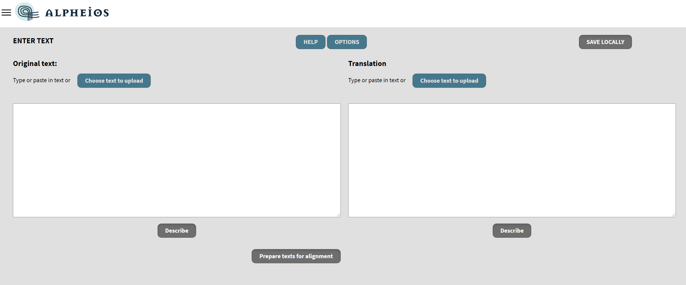
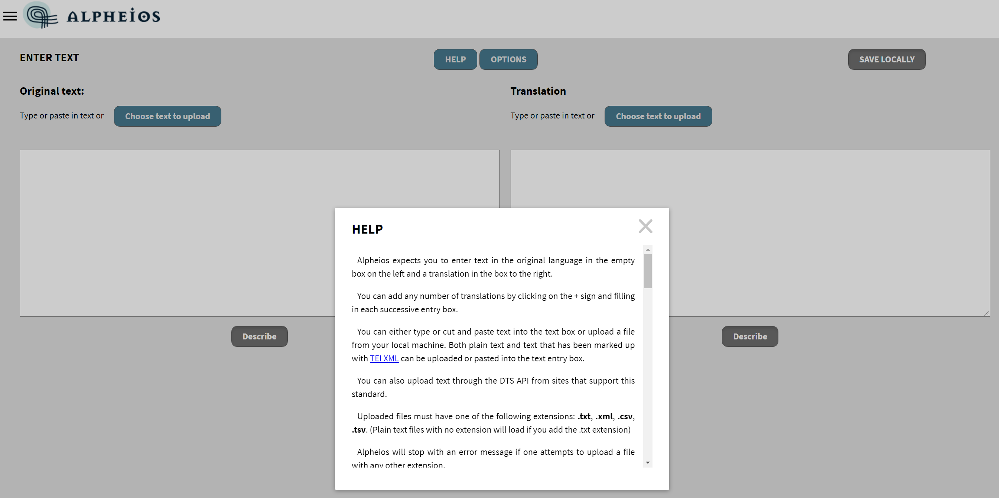
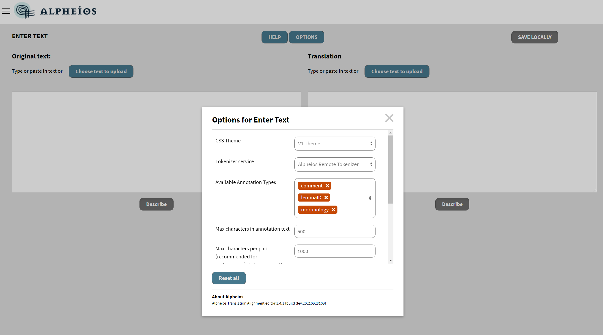
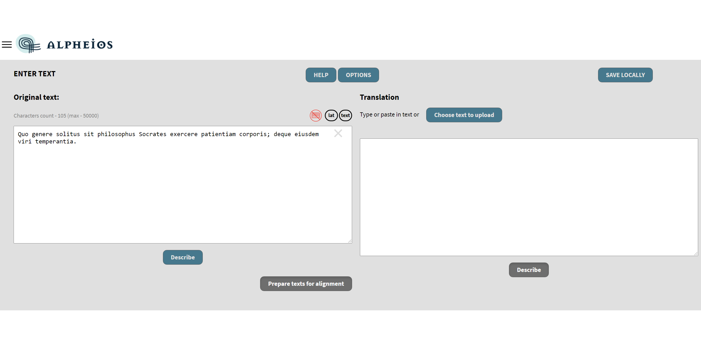
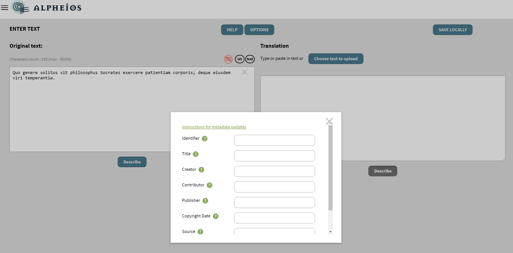

# Simple Tutorial

1. This is the first screen that you will see after loading the application from [https://alignment.alpheios.net](https://alignment.alpheios.net/). From this screen you can either **Start a new alignment** or **Resume a previous alignment** that you started but didn't finish.

2. Click on the **Start a new alignment** button.

3. **HELP** and **OPTIONS** are at the top of the screen with two text boxes below them. The Help popup window will provide instructions on how to enter text here.

4. The Options popup window will give you an access to some useful settings - you could read detailed description [here](enter-text-options-details.md).

5. You should begin by entering the original text in the left hand text box. Let's type in some Latin (this sample is from [AVLI GELLI NOCTES ATTICAE: LIBER II](http://www.thelatinlibrary.com/gellius/gellius2.shtml)). You will notice that as soon as you click outside the text box some new icons appear.

6. The first one warns you that no metadata description of this text has been entered yet. If you click on this icon a popup will appear in which you can enter the missing description. The same popup will appear if you click on the "Describe" button under the text box. More details about adding metadata for the text you could read [here](metadata-details.md).

