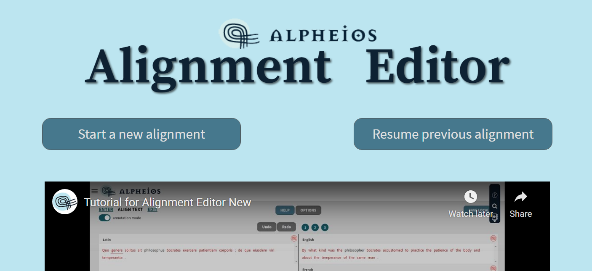

# Simple Tutorial

1. This is the first screen that you will see after loading the application from [https://alignment.alpheios.net](https://alignment.alpheios.net/). From this screen you can either **Start a new alignment** or **Resume a previous alignment** that you started but didn't finish.

2. Click on the **Start a new alignment** button.

3. **HELP** and **OPTIONS** are at the top of the screen with two text boxes below them. The Help popup window will provide instructions on how to enter text here.

4. The Options popup window will give you an access to some useful settings - you could read detailed description [here](enter-text-options.md).

5. You should begin by entering the original text in the left hand text box. Let's type in some Latin (this sample is from [AVLI GELLI NOCTES ATTICAE: LIBER II](http://www.thelatinlibrary.com/gellius/gellius2.shtml)). You will notice that as soon as you click outside the text box some new icons appear.

6. The first one warns you that no metadata description of this text has been entered yet. If you click on this icon a popup will appear in which you can enter the missing description. The same popup will appear if you click on the **Describe** button under the text box. More details about adding metadata for the text you could read [here](metadata.md).

7. The second icon shows the language that the application believes it has detected (details about language detection are [here](language-detection.md)). If this is not the correct language you can click on this icon and redefine it manually. You can either select the correct language from the dropdown list or enter the language code in the empty box.

8. The third icon shows whether TEI markup has been detected - indicating either plain text or TEI XML. You can click on it and correct the text type if it was detected incorrectly. There are some specific options for the tokenizer here - you can read details about tokenizer options [here](tokenizer-options.md). 

9. Now we are ready to enter the translation text - let's enter an english translation of the Latin sample. We can now see similiar icons for the translation - no description, english language and plain text.

10. We could now add additional translations - clicking on the plus icon will open a new text box. Let's upload a french translation from the text file. You need to click **Choose text to upload** button. Click **Choose File**. Select a file from your local file system with the file browser and click **Open**. Text is uploaded - french language and plain text are detected.

11. Now let's add a translation from the DTS API Collection. Click the Plus icon. Click **Choose text to upload** and then **DTSAPI**. There are 2 collections available. Let's choose - **Beta maṣāḥǝft DTS API**. Upload process has started. Select **Beta maṣāḥǝft Textual Units**. You can see the available texts in the collection - all of them are in TEI XML format. Let's select the first text - **Conclusion of the prayers for the ninth hour**. Choose the first(and only) part of the text - **Incipit** and click **Upload** button. TEI XML text is uploaded from the collection, Geez language is pre-defined for xml text type.

12. Now we are ready to tokenize our texts. Click on the button - **Prepare texts for alignment**. A popup will now show you summary information about the texts. If you see any incorrect information, click **Cancel** and update it. When all data is correct, click **All Ok** to begin the tokenization process that will prepare the
texts for alignment.

13. Now we are on the ALIGN TEXT screen. This is where we actually link words or phrases from the original with words or phrases in the translations. HELP and OPTIONS appear on the top of the screen again. We see only one translation on the screen at a time. The others can be brought up by clicking on tabs.

14. The alignment editor is designed to permit you to link words or phrases in one text with words and phrases in another text so that when you mouse over any one word all other words that have been linked to it will be highlighted. This is useful, for example, to show the translations of words. To link words in different texts you simply click on the first word, which will turn green indicating that it is waiting to be linked to something, and then click on the word you want to link to in the other text, turning it yellow. But to save this link you must return to original screen and click on the green word. This will create a permanent  link, and the linked text will turn black until it is moused over, when all the words it is linked to will highlight in yellow.

15. You can also link phrases in both texts by selecting all the words in one text and then selecting all the words in the other text before returning to the initial green word to save this group of links.

16. To dissolve a group of links you can double click on any word in the group in either text and then single click on each other word in the group until they have all returned to an unlinked red status. You can also dissolve the links in the most recent group you created just by hitting the Undo button repeatedly. detailed information about linking features could be found [here](alignment-groups.md).

17. At any time we can navigate back to the ENTER TEXT screen and add a new translation text by clicking on the plus icon. And easily return to the ALIGN TEXT screen with the help of navigation links in the left top corner of each screen.

18. If you want to add an annotation to the word you must switch to annotation mode by clicking on the toggle switch. Now when you click on a word you will see a box into which you can enter your annotation. More details could be found [here](annotations.md).

